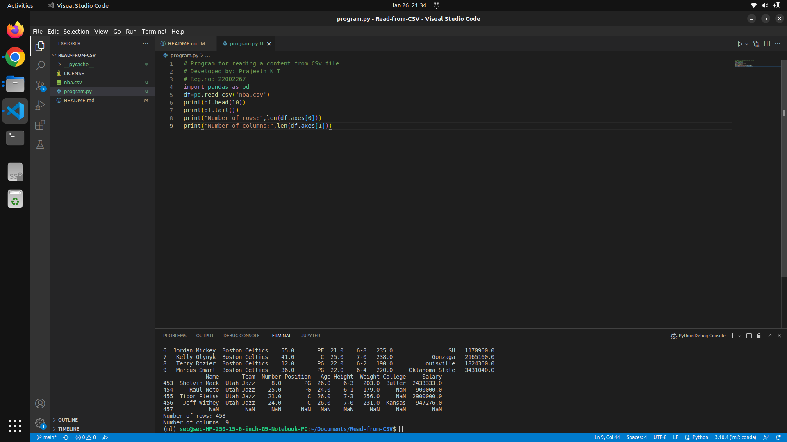

# READ FROM CSV

## AIM:
To read the contents from a CSV file

## EQUIPMENTS REQUIRED:
1.Hardware - PCs

2.Anaconda - Python 3.7

## ALGORITHM:

### Step 1:
Download the CSV file
### Step 2:
Open a python platform
### Step 3:
Create a folder in python
### Step 4:
Copy the downloaded CSV file to the python folder
### Step 5:
Run the program

## PROGRAM:
```python
# Program for reading a content from CSv file
# Developed by: Prajeeth K T
# Reg.no: 22002267
import pandas as pd
df=pd.read_csv('nba.csv')
print(df.head(10))
print(df.tail())
print("Number of rows:",len(df.axes[0]))
print("Number of columns:",len(df.axes[1]))
```

## OUTPUT:


## RESULT:
Thus a program to read a CSV file has been developed and executed successfully